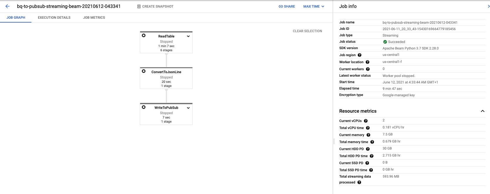
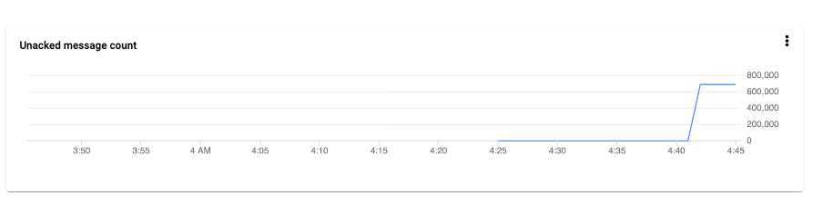
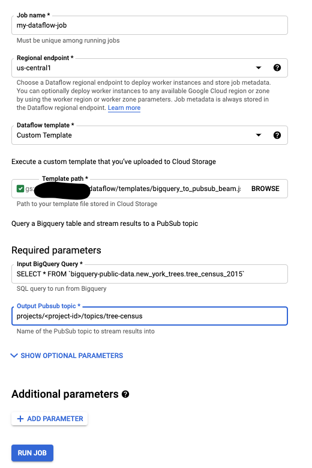

Reverse ETL the process of moving data from a data warehouse into third party systems/internal tools to make data
operational. The major use-case for reverse ETL is Operational Analytics which refers to feeding insights from analytics
to business teams in their usual workflow, so they can make more data-informed decisions. Another use-case I have found 
it really useful for is offloading heavy computations to the data warehouse. 

This article explores how to build an efficient pipeline to get data out of BigQuery into operational systems.

You might wonder why not use the BigQuery APIs directly from the required service? Well, that could work for lighter 
workloads. With heavier workloads, you don't really want to get into writing application logic to pull large amounts of 
records. 

### Apache Beam 

>Apache Beam is an open source, unified model for defining both batch and streaming data-parallel processing pipelines. Using one of the open source Beam SDKs, you build a program that defines the pipeline. The pipeline is then executed by one of Beam’s supported distributed processing back-ends, which include Apache Flink, Apache Spark, and Google Cloud Dataflow. [More..](https://beam.apache.org/get-started/beam-overview/)

To illustrate, we are read a table from the [BigQuery public dataset](https://cloud.google.com/bigquery/public-data).
The table is called `bigquery-public-data:new_york_trees.tree_census_2015` which contains NYC tree street data.


I wrote a reusable python dataflow flex template [here](https://github.com/dejii/bigquery-to-pubsub-beam). This template
creates a pipeline that reads records from a table in BigQuery and publishes them to a Pub/Sub topic. It takes in
two parameters 
- `input_query` - BigQuery SQL query to be executed.
- `output_topic` - Output Pubsub topic to write results to.

After setting up the template on a GCP project, we can run the pipeline by doing the following
```shell
PROJECT=<project-id>
BUCKET=<bucket-name>
REGION=us-central1
TEMPLATE_PATH="gs://$BUCKET/dataflow/templates/bigquery_to_pubsub_beam.json"
gcloud dataflow flex-template run "bq-to-pubsub-streaming-beam-`date +%Y%m%d-%H%M%S`" \
    --template-file-gcs-location "$TEMPLATE_PATH" \
    --parameters input_query="SELECT * FROM \`bigquery-public-data.new_york_trees.tree_census_2015\`" \
    --parameters output_topic="projects/$PROJECT/topics/tree-census" \
    --region "$REGION"
```
\
Dataflow Job Metrics.

\
Records published in a short span of time.

\
Alternatively, Google Cloud allows you to create jobs from templates using the cloud console.



### Summary
We have taken an approach originally meant for doing ETL and applied it to a reverse scenario. An advantage of using 
templates is its re-usability. We can take this template and use it for different jobs that take this approach.
You can conveniently start a job using the Cloud Console UI or schedule it programmatically using your favorite
orchestration tool e.g. Airflow or even communicating directly with the Google APIs.